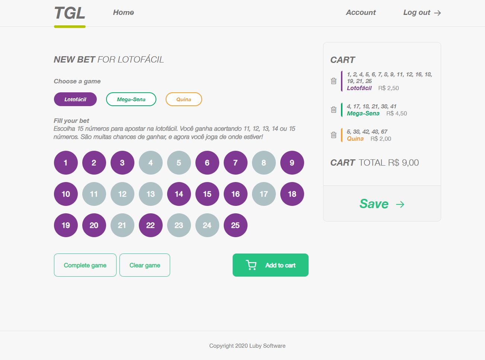

# Prova Final Javascript

## Requisitos Não Funcionais
- Construir toda a página utilizando Html, CSS e Javascript Puro.
- Consumir o arquivo JSON para obter os jogos e suas regras.
- Se preferir, pode utilizar bootstrap.

## Requisitos Funcionais
- "Complete Game": para completar aleatoriamente os números.
- "Clear game": limpar todos os números selecionados.
- "Add to cart" adicionar os números ao carrinho (Poderá ser adicionado, vários jogos no carrinho, independente se for o mesmo jogo ou não)
- "Delete" apagar um item do carrinho

### Example
